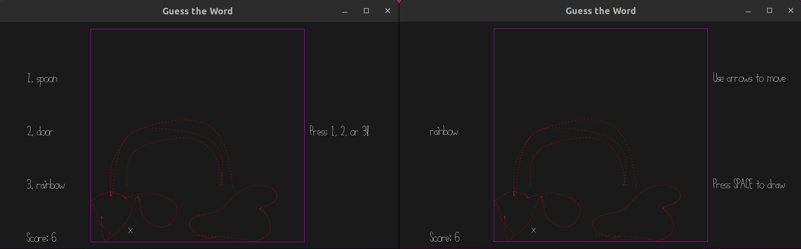

# Guess the Word!

## Author: Jiyoon Park 

## Design: 

In this two person game (Drawer and Guesser), the Guesser has to guess what the Drawer is drawing. 

## Networking: 

(TODO: How does your game implement client/server multiplayer? What messages are transmitted? Where in the code?)

## Screen Shot:

## How To Play:

- The first client is the Drawer and the second client is the Guesser

### Drawer

- You are given a word to draw. 

- You have to navigate around the canvas and draw!

- Your pen will only draw when you are pressing down the __SPACE BAR__!

- Be aware, it is not easy to draw something!

### Guesser

- You have to guess what the Drawer is drawing. 

- You are given three candidate words to choose from 

- Once you catch what the drawing is of, press __1__ or __2__ or __3__ to check if your guess is correct!

- If you want to play the game again when it is over, press __r__ ( just pressing __r__ randomly will just lower your score)

### General 

This game was built with [NEST](NEST.md).

## TODOs

[x] guesser location separation
[x] guesser movement, input 
[x] score board
[x] clear the drawer's list after level resets
[x] display text
[x] send over the chosen words over network 
[x] even if it is wrong, the score goes up
[x] why does it overlay words?